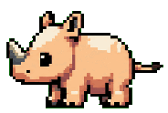

# 👋 hi, i'm rhinoc

I make small tools from tiny irritations, usually with a local-first bend and a soft spot for calm interfaces.

## selected work

| project | what it is |
| --- | --- |
| [mailia](https://github.com/rhinoc/mailia) | an email companion that organizes mail around people instead of folders |
| [lofii](https://github.com/rhinoc/lofii) | a compact lofi player with ambient scenes, custom media, and Live2D desk companions |
| [liltr](https://github.com/rhinoc/liltr) | a translation tool with OCR and custom API support |
| [stiki](https://github.com/rhinoc/stiki) | a lightweight sticky-note style desktop app with themes, startup support, and deep links |
