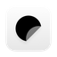

# 👋 hi, i'm rhinoc

I make small tools from tiny irritations, usually with a local-first bend and a soft spot for calm interfaces.

## selected work

<table>
  <tr>
    <td width="50%" valign="top">
      <a href="https://github.com/rhinoc/mailia"> mailia</a> 
      an email companion that organizes mail around people instead of folders
    </td>
    <td width="50%" valign="top">
      <a href="https://github.com/rhinoc/lofii"> lofii</a> 
      a compact lofi player with ambient scenes, custom media, and Live2D desk companions
    </td>
  </tr>
  <tr>
    <td width="50%" valign="top">
      <a href="https://github.com/rhinoc/liltr"> liltr</a> 
      a translation tool with OCR and custom API support
    </td>
    <td width="50%" valign="top">
      <a href="https://github.com/rhinoc/stiki"> stiki</a> 
      a lightweight sticky-note style desktop app with themes, startup support, and deep links
    </td>
  </tr>
</table>
